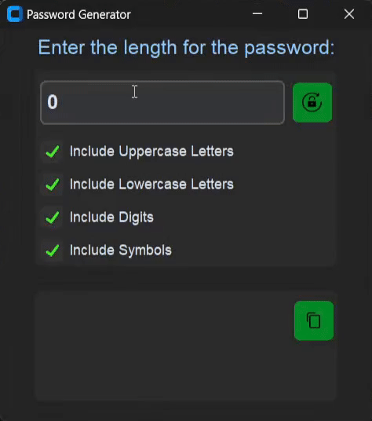

# 🔐 Password Generator

A simple and secure password generator GUI application built with Python and tkinter.

## Overview

This application allows users to generate strong passwords with customizable options for length and character sets (uppercase letters, lowercase letters, digits, and symbols). It features a user-friendly interface and includes functionality to copy generated passwords directly to the clipboard.

## Features ✨

- Generate passwords of varying lengths (minimum 1 character).
- Select character sets to include in generated passwords: uppercase letters, lowercase letters, digits, and symbols.
- Copy generated passwords to the clipboard with a single click.
- Visual feedback with a rotating button image upon password generation.


## Screenshots  📸
<p align='center'>
   
</p>

## Installation 🛠️

1. **Clone the repository:**
   ```bash
   git clone https://github.com/Vikas-saroj/Password-Generator.git
   cd password-generator
   ```

2. **Install dependencies:**

   ```bash
   pip install customtkinter
   ```
3. **Run the application:**

   ```bash
   python password.py
   ```

## Usage 🚀

- Enter the desired length of the password.
- Check the character set options you want to include.
- Click the "Generate" button to create a password.
- Click the "Copy" button to copy the generated password to your clipboard.

  
## Contributing 🤝

Contributions are welcome! Please fork the repository and create a pull request with your improvements.

## License 📜

This project is licensed under the MIT License - see the [LICENSE](./LICENSE) file for details.
## Acknowledgments

- Built using Python, tkinter, and customtkinter.
- Icons and images sourced from images/ directory.


## 📧 Contact
If you have any questions or suggestions, feel free to reach out to me at [Vikas Saroj](vikas.saroj.gs8@example.com) . 


---

🔒💻 Happy password generating!
---


⭐️ Don't forget to give this project a star if you found it helpful!


